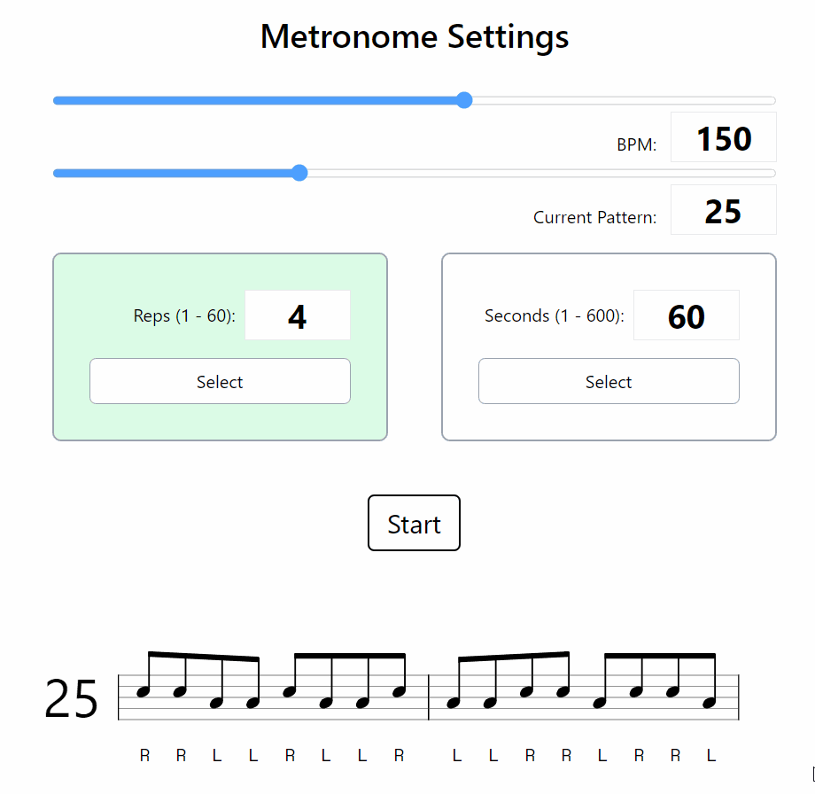

# Interactive Stick Control

Practice your rhythms, customize your routine, and master your technique with this interactive Stick Control and metronome tool. 

## Features

Interactive Stick Control features two practice modes, a fully-functional metronome, and all 72 single-beat combinations, allowing for effective practice sessions. Change the beats per minute to suit your needs, set either the amount or time for each pattern, and drum away! 

## Technology

Built with Svelte and Tailwind. Deployed on Netlify. [Vexflow](https://github.com/0xfe/vexflow) used for sheet music rendering. 
